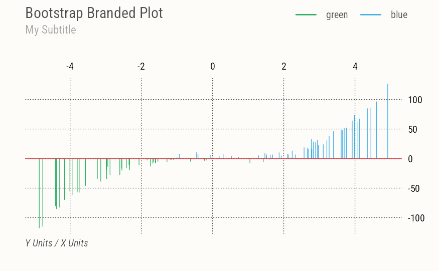

# mbutils

R package with Mel’s utilities for data science projects and (Quarto)
web publishing.

In particular this package includes **Bootstrap** themes and color
scales for **base R graphics**, **lattice** and **ggplot**, implementing
the (recent) [brand.yml](https://posit-dev.github.io/brand-yml/)
flexible document branding system.

This feature allows for logos, primary colors, color palettes and fonts
to be specified and swapped across projects and clients using run-time
YAML config files and well-known Bootstrap Sass variables. This package
includes (my personal) themes and additional utilities to flexibly turn
Bootstrap features on/off.

## Installation

You can install this package from the development version on GitHub:

``` r

if (!require("pak")) install.packages("pak")
pak::pak("mbacou/mbutils")
```

## Documentation

For complete R package documentation and technical guides, see the
[package vignette](https://mbacou.github.io/mbutils/).

My default (opinionated) plots with custom sizing and spacing and a
default X-axis on the right.

``` r

library(mbutils)
brand_on(bg="transparent")

set.seed(1)
x <- runif(100, min = -5, max = 5)
y <- x ^ 3 + rnorm(100, mean = 0, sd = 5)

plot(x, y, type="h", col=(y>0)+4, nx=NULL,
  main="Bootstrap Branded Plot", sub="My Subtitle",
  xlab="X Units", ylab="Y Units")
abline(h=0, col=pal.brand("red"), lwd=2)
legend(names(pal.brand())[4:5], lty=1, lwd=2, col=4:5)

brand_off()
```



Sample branded plot

## License

This package is licensed under the terms of the [GNU General Public
License](https://www.gnu.org/licenses/gpl-3.0.html) version 3 or later.

Copyright 2021-2026 Melanie Bacou.
